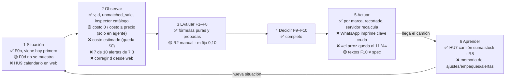
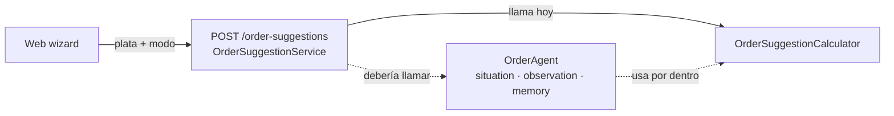

# Mapa del agente (estado al 2026-09-24)

Vocabulario común para decidir qué construir. Estado: ✅ listo · 🟡 a medias / sin conectar · ❌ falta.

## Conexión real hoy

`OrderAgent` (packages/order-agent/src/agent) no lo llama ninguna ruta: situación, alertas y memoria no llegan al dueño.

## Prioridades

1. Conectar `OrderAgent` a `/order-suggestions`.
2. `OrderSuggestion.toPlainText()` imprime la clave i18n en vez del mensaje.
3. Formulario de calendario en la web (HU9; `PATCH /suppliers/:id` ya existe).
4. Costo estimado = `precio ÷ (1 + margen)` al importar catálogo (hoy $0).

## Brechas que afectan el pedido al vendedor

1. `v` no respeta el ciclo del proveedor: el parser suma por código y pierde la fecha, y la API usa `findLatest` global. No se puede recortar al rango F0d [última entrega, víspera de la visita].
2. El rechazo de Excels con fechas solapadas impide cargar rangos distintos para proveedores con días distintos.
3. Líneas que se pierden: código con punto final, códigos internos sin proveedor, categoría que es proveedor.
4. `e` = 1 por defecto: el pedido sale en unidades y no en empaques reales del vendedor.
5. Costo 0 o dudoso: el total queda mal y F9 reparte mal.
6. F9 con poca plata favorece productos de una sola venta (arroz al 11 %). Decisión abierta del dueño.
7. Texto de WhatsApp con clave cruda; el dueño no puede subir por encima del máximo.

## Regla real del dueño (2026-09-24) frente al código

| Regla del dueño | Estado |
|---|---|
| Plata = caja del día, compartida entre los pedidos del día | ✅ tabla `daily_cash`, `/daily-cash/today`; B = min(caja que queda, tope, límite del dueño) |
| Pedido entre $20.000 y $250.000 | ✅ `minimum_order_amount` 20000 y `maximum_order_amount` 250000 por proveedor; el mínimo solo avisa |
| Movimiento de la semana | ✅ v ÷ d (con la brecha A1) |
| Base por producto y proveedor | ✅ modo `fill_to_base` (por defecto): objetivo = base; sin base → v |
| Faltante = base − stock | ✅ incluye productos no vendidos con base; usa el stock aunque no esté contado; el paso «Caja y existencias» permite contarlo |
| Si no alcanza, pedir un poco menos | ✅ F9 |
| Pedido lunes a sábado, entrega otro día | ✅ L = (entrega − pedido) mod 7 · ❌ no se edita desde la web |
| Entrega en el mismo momento (autoventa) | ✅ L = 0 probado |

Respuestas del dueño: rango = $20.000–$250.000 por pedido · con venta baja igual se rellena la base (base − stock) · el segundo pedido del día sale de lo que quedó en caja.

## Símbolos

v vendidas · d días del Excel · F días entre visitas (7/14) · L días de entrega · s stock · T tope · e empaque · c costo · m colchón (0,10) · B plata.
